# AZ 120 Module 4: Deploy SAP on Azure
# Lab 4a: Implement SAP architecture on Azure VMs running Linux

Estimated Time: 100 minutes

All tasks in this lab are performed from the Azure portal (including the Bash Cloud Shell session)  

   > **Note**: When not using Cloud Shell, the lab virtual machine must have Azure CLI installed [**https://docs.microsoft.com/en-us/cli/azure/install-azure-cli-windows**](https://docs.microsoft.com/en-us/cli/azure/install-azure-cli-windows).

Lab files: none

## Scenario
  
In preparation for deployment of SAP NetWeaver on Azure, Adatum Corporation wants to implement a demo that will illustrate highly available implementation of SAP NetWeaver on Azure VMs running the SUSE distribution of Linux.

## Objectives
  
After completing this lab, you will be able to:

-   Provision Azure resources necessary to support a highly available SAP NetWeaver deployment

-   Configure operating system of Azure VMs running Linux to support a highly available SAP NetWeaver deployment

-   Configure clustering on Azure VMs running Linux to support a highly available SAP NetWeaver deployment

## Requirements

-   A Microsoft Azure subscription with the sufficient number of available Dsv3 vCPUs (four Standard_D2s_v3 VMs with 2 vCPUs each and two Standard_D4s_v3 VMs with 4 vCPUs each) in an Azure region that supports availability zones

-   A lab computer with an Azure Cloud Shell-compatible web browser and access to Azure


## Exercise 1: Provision Azure resources necessary to support highly available SAP NetWeaver deployments

Duration: 30 minutes

In this exercise, you will deploy Azure infrastructure compute components necessary to configure Linux clustering. This will involve creating a pair of Azure VMs running Linux SUSE in the same availability set.

### Task 1: Create a virtual network that will host a highly available SAP NetWeaver deployment.

1.  In the Azure Portal, start a Bash session in Cloud Shell. 

     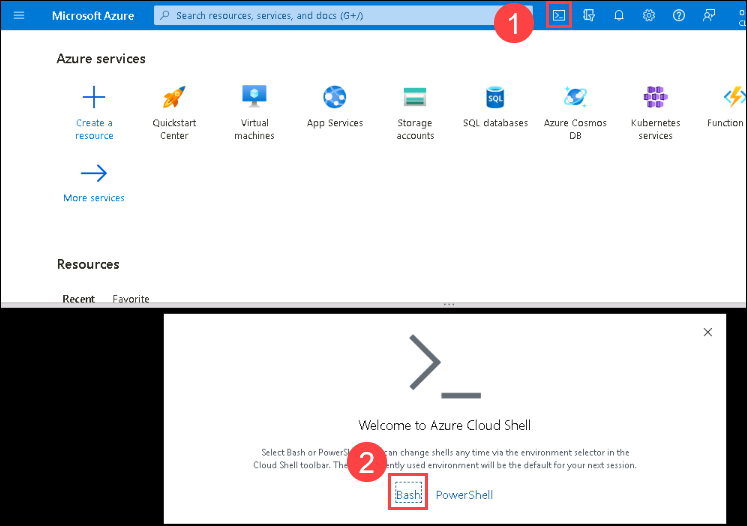

1.  When *no storage mounted* is prompted, then select Show advanced settings and then select Use existing and choose **az12003a-dmz-RG** resource group. Then select Create new against Storage account and enter **cloudstore<inject key="DeploymentID" enableCopy="false"/>** as well as for File Share, select Create new and enter **blob** and then click on Create storage, and wait for the Azure Cloud Shell to initialize.

     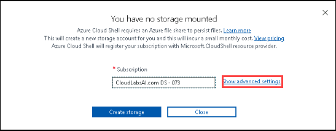
     
     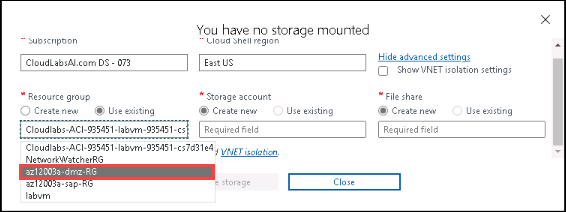
     
     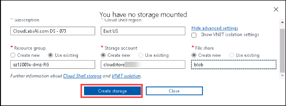     


1. In the Cloud Shell pane, run the following command to set the value of the variable `RESOURCE_GROUP_NAME` to the name of the resource group which was precreated and will use this resource group to provision new resources. 

    ```cli
    RESOURCE_GROUP_NAME='az12003a-sap-RG'
    ```

1.  In the Cloud Shell pane, run the following command to create a virtual network with a single subnet in the existing resource group:

    ```cli
    VNET_NAME='az12003a-sap-vnet'

    VNET_PREFIX='10.3.0.0/16'

    SUBNET_NAME='sapSubnet'

    SUBNET_PREFIX='10.3.0.0/24'

    az network vnet create --resource-group $RESOURCE_GROUP_NAME --name $VNET_NAME --address-prefixes $VNET_PREFIX --subnet-name $SUBNET_NAME --subnet-prefixes $SUBNET_PREFIX
    ```

1.  In the Cloud Shell pane, run the following command to identify the Resource Id of the subnet of the newly created virtual network:

    ```cli
    az network vnet subnet list --resource-group $RESOURCE_GROUP_NAME --vnet-name $VNET_NAME --query "[?name == '$SUBNET_NAME'].id" --output tsv
    ```

1.  Copy the resulting value to Clipboard. You will need it in the next task.

### Task 2: Deploy Azure Resource Manager template provisioning Azure VMs running Linux SUSE that will host a highly available SAP NetWeaver deployment

1.  On the lab computer, start a browser and browse to [**https://github.com/Azure/azure-quickstart-templates/tree/master/application-workloads/sap/sap-3-tier-marketplace-image-md**](https://github.com/Azure/azure-quickstart-templates/tree/master/application-workloads/sap/sap-3-tier-marketplace-image-md)

    > **Note**: Make sure to use Microsoft Edge or a third party browser. Do not use Internet Explorer.

1.  On the page titled **SAP NetWeaver 3-tier (managed disk)**, click **Deploy to Azure**. This will automatically redirect your browser to the Azure portal and display the **SAP NetWeaver 3-tier (managed disk)** blade.

     

1.  On the **SAP NetWeaver 3-tier (managed disk)** blade, select **Edit template**.

1.  On the **Edit template** blade, apply the following changes and select **Save**:

    -   in the line **197**, replace `"dbVMSize": "Standard_E8s_v3",` with `"dbVMSize": "Standard_D4s_v3",`

     

1.  On the **SAP NetWeaver 3-tier (managed disk)** blade, initiate deployment with the following settings:

    -   Subscription: *Leave the default subscription*
    
    -   Resource group: Select **az12003a-sap-RG** from the drop-down list.

    -   Location: *Leave the default region*

    -   SAP System Id: **I20**

    -   Stack Type: **ABAP**

    -   Os Type: **SLES 12**

    -   Dbtype: **HANA**

    -   Sap System Size: **Demo**

    -   System Availability: **HA**

    -   Admin Username: **student**

    -   Authentication Type: **password**

    -   Admin Password Or Key: **Pa55w.rd1234**

    -   Subnet Id: *the value you copied into Clipboard in the previous task*

    -   Availability Zones: **1,2**

    -   Location: **[resourceGroup().location]**

    -   _artifacts Location: **https://raw.githubusercontent.com/Azure/azure-quickstart-templates/master/application-workloads/sap/sap-3-tier-marketplace-image-md/**

    -   _artifacts Location Sas Token: *leave blank*

     
     
     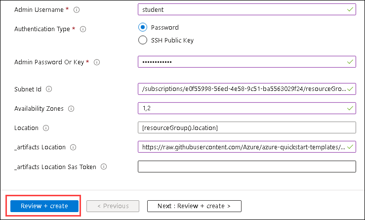     

1.  Do not wait for the deployment to complete but instead proceed to the next task. 

       > **Note**: If the deployment fails with the **Conflict** error message during deployment of the CustomScriptExtension component, use the following steps  to remediate this issue:

       - in the Azure portal, on the **Deployment** blade, review the deployment details and identify the VM(s) where the installation of the CustomScriptExtension failed

       - in the Azure portal, navigate to the blade of the VM(s) you identified in the previous step, select **Extensions**, and from the **Extensions** blade, remove the CustomScript extension

       - in the Azure portal, navigate to the **az12003a-sap-RG** resource group blade, select **Deployments**, select the link to the failed deployment, and select **Redeploy**, select the target resource group (**az12003a-sap-RG**) and provide the password for the root account (**Pa55w.rd1234**).


### Task 3: Deploy a jump host

   > **Note**: Since Azure VMs you deployed in the previous task are not accessible from Internet, you will deploy an Azure VM running Windows Server 2019 Datacenter that will serve as a jump host. 

1.  From the lab computer, in the Azure portal, click **+ Create a resource**.

1.  From the **New** blade, initiate creation of a new Azure VM based on the **Windows Server 2019 Datacenter** image.

1. Provision a Azure VM with the following settings under **Basics** tab (leave all others with their default values) and click on **Next:Disks**:

    | Setting | Value |
    |   --    |  --   |
    | **Subscription** | *Leave the default subscription*  |
    | **Resource group** | Select **az12003a-dmz-RG** resource group from drop-down list|
    | **Virtual machine name** | **az12003a-vm0** |
    | **Region** | *Leave the default region* |
    | **Availability options** | **No infrastructure redundancy required** |
    | **Image** | *select* **Windows Server 2019 Datacenter - Gen2** |
    | **Size** | **Standard D2s_v3** (you can select it from clicking **see all sizes**)|
    | **Username** | **Student** |
    | **Password** | **Pa55w.rd1234** |
    | **Public inbound ports** | **Allow selected ports** |
    | **Selected inbound ports** | **RDP (3389)** |
    | **Would you like to use an existing Windows Server license?** | **No** |

1.  Under **Disks** tab, fill the following details (leave all others with their default values) and click on **Next:Networking**:

    | Setting | Value |
    |   --    |  --   |
    | **OS disk type** | **Standard HDD** |

1.  Under **Networking** tab, fill the following details:

    | Setting | Value |
    |   --    |  --   |
    | **Virtual network** | **az12003a-sap-vnet** |

    - For **Subnet name**- click on **Manage Subnet Configuration**, then select **+Subnet**. On the Add Subnet page, provide the following values and click on **Save**:

    -  **Subnet name** - **bastionSubnet** 
    -  **Subnet address range** - **10.3.255.0/24** 

      
      
      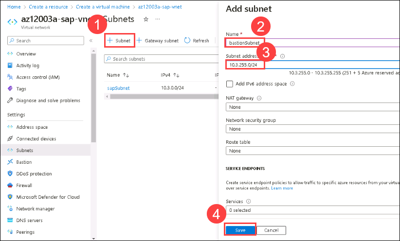    
      
 1. After creating the new subnet, move back to the **Networking** tab of Create a virtual machine, and fill the other remaining details (leave all others with their default values) and click on **Next:Management**:

    | Setting | Value |
    |   --    |  --   |
    | **Subnet name** | **bastionSubnet** *select the one that you have created in the previous step* |
    | **Public IP address** | *a new IP address named* **az12003a-vm0-ip** |
    | **NIC network security group** | **Basic**  |
    | **Public inbound ports** | **Allow selected ports** |
    | **Selected inbound ports** | **RDP (3389)** |
    | **Enable accelerated networking** | **On** |
    | **Load balancing Options** | **None** |    
    
 1. On the **Management** tab, fill the following details (leave all others with their default values) and click on **Next:Monitoring**:

    | Setting | Value |
    |   --    |  --   |
    | **Enable system assigned managed identity** | **Off** |
    | **Login with Azure AD** | **Off** |
    | **Enable auto-shutdown** | **Off** |
    | **Patch orchestration options** | **Manual Updates** |

1. On the **Monitoring** tab, fill the following details (leave all others with their default values) and click on **Next:Advanced**:    

    | Setting | Value |
    |   --    |  --   |
    | **Boot diagnostics** | **Disable** |
    | **Enable OS guest diagnostics** | **Off** |

1. On the **Advanced** tab, fill the following details (leave all others with their default values) and click on **Next:Tags**:        

    | Setting | Value |
    |   --    |  --   |  
    | **Extensions** | *None* |

1. On the **Tags** tab, fill the following details (leave all others with their default values) and click on **Next:Review+create**:      

    | Setting | Value |
    |   --    |  --   |
    | **Tags** | *None* |

1. Click on **Create**.

1.  Wait for the provisioning to complete. This should take a few minutes.

> **Result**: After you completed this exercise, you have provisioned Azure resources necessary to support highly available SAP NetWeaver deployments


## Exercise 2: Configure Azure VMs running Linux to support a highly available SAP NetWeaver deployment

Duration: 30 minutes

In this exercise, you will configure Azure VMs running SUSE Linux Enterprise Server to accommodate a highly available SAP NetWeaver deployment.

### Task 1: Configure networking of the database tier Azure VMs.

   > **Note**: Before you start this task, ensure that the template deployments you initiated in the previous exercise have successfully completed. 

1.  From the lab computer, in the Azure portal, navigate to the blade of the **i20-db-0** Azure VM.

      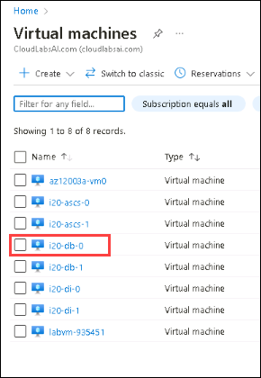

1.  From the **i20-db-0** blade, navigate to its **Networking** blade. 

      

1.  From the **i20-db-0 - Networking** blade, navigate to the network interface of the i20-db-0. 

      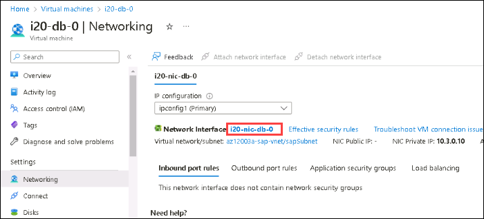

1.  From the blade of the network interface of the i20-db-0, navigate to its IP configurations blade and, from there, display its **ipconfig1** blade.

      

1.  On the **ipconfig1** blade, change its assignment to **Static**, set the private IP address to **10.3.0.20** and save the change.

      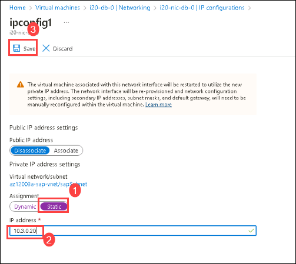

1.  In the Azure portal, navigate to the blade of the **i20-db-1** Azure VM.

      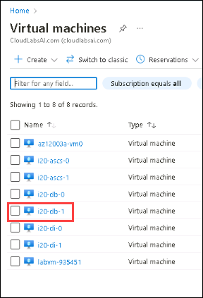

1.  From the **i20-db-1** blade, navigate to its **Networking** blade. 

      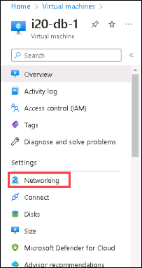

1.  From the **i20-db-1 - Networking** blade, navigate to the network interface of the i20-db-1. 

      

1.  From the blade of the network interface of the i20-db-1, navigate to its IP configurations blade and, from there, display its **ipconfig1** blade.

      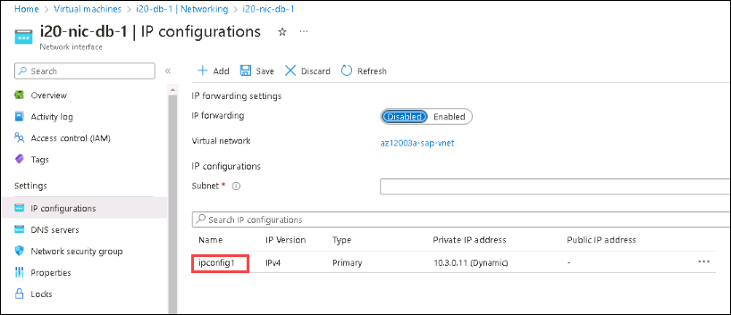

1.  On the **ipconfig1** blade, change its assignment to **Static**, set the private IP address to **10.3.0.21** and save the change.

      


### Task 2: Connect to the database tier Azure VMs.

1.  From the lab computer, in the Azure portal, navigate to the **az12003a-vm0** blade.

1.  From the **az12003a-vm0** blade, connect to the Azure VM az12003a-vm0 via Remote Desktop, select **Download RDP file** and click on *keep* to download the file and open the downloaded RDP file, click on **Connect**. 

      
      
      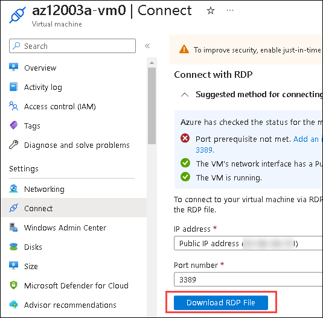
      
      
      
      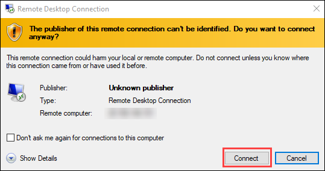
      
 1.  Use the below credientials to connect. 

      -   Login as: **.\student**

      -   Password: **Pa55w.rd1234**

1.  Within the RDP session to az12003a-vm0, in Server Manager, navigate to the **Local Server** view and turn off **IE Enhanced Security Configuration**.

      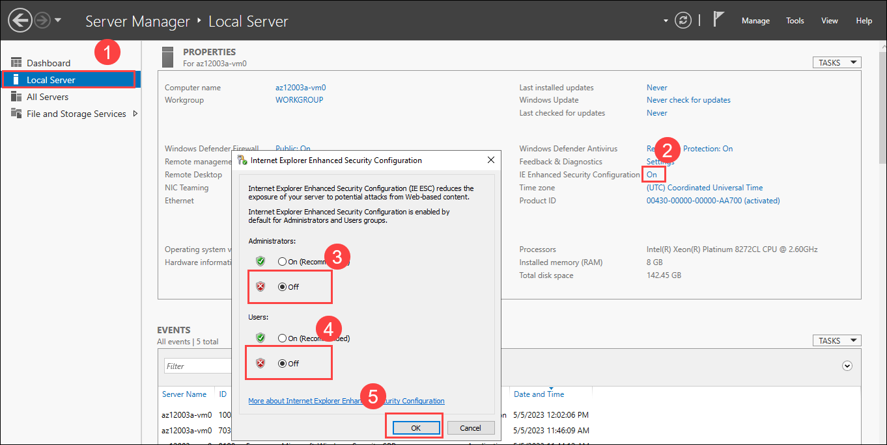
      
1.  Within the RDP session to az12003a-vm0, Open Internet Explorer and click on **Ask me later** within the pop-up.

      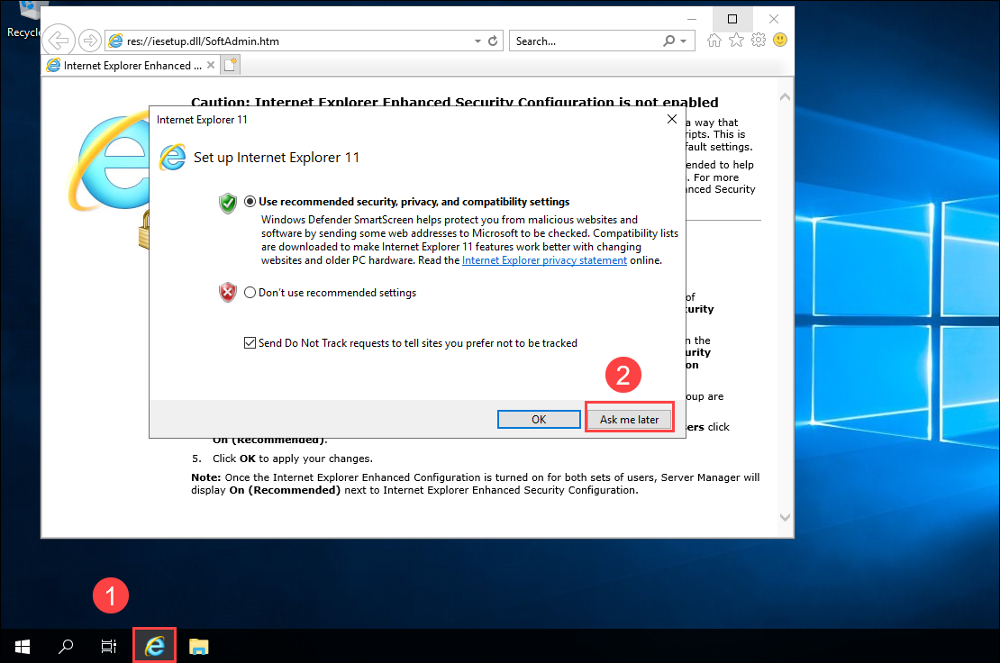
      
1.  Open a new tab, the edge browser welcome screen will come up, select **Start without your data**.

   
   
1.  On the next window, click on **Continue without this data**.

    
   
1.  Click on **Confirm and start browsing**.

       

1.  Now download and install PuTTY from [**https://www.chiark.greenend.org.uk/~sgtatham/putty/latest.html**](https://www.chiark.greenend.org.uk/~sgtatham/putty/latest.html).

      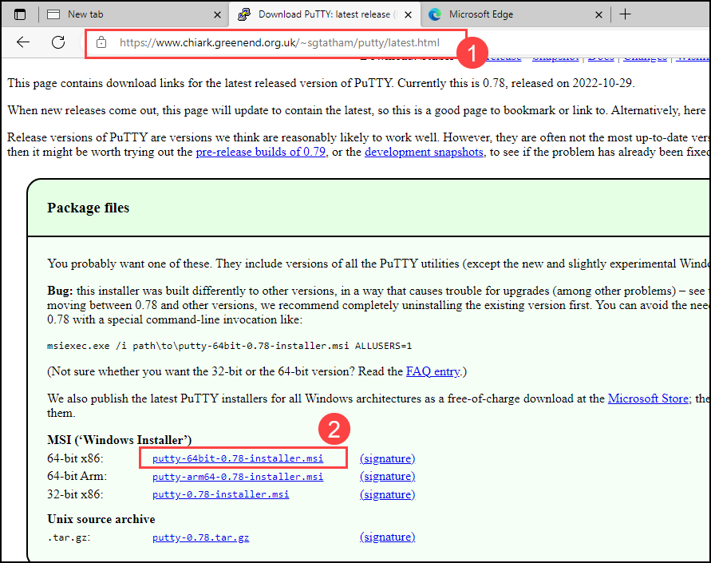

1.  Use PuTTY to connect via SSH to **i20-db-0** Azure VM. Acknowledge the security alert and click on **Accept** and, when prompted, provide the following credentials:

      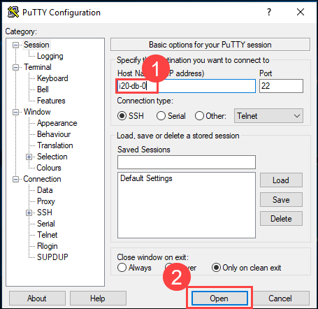
      
    -   Login as: **student**

    -   Password: **Pa55w.rd1234**

1.  Use PuTTY to connect via SSH to **i20-db-1** Azure VM with the same credentials.


### Task 3: Examine the storage configuration of the database tier Azure VMs.

1.  From within the PuTTY SSH session to i20-db-0 Azure VM, run the following command to elevate privileges: 

    ```
    sudo su -
    ```

1.  If prompted for the password, type **Pa55w.rd1234** and press the **Enter** key. 

1.  In the SSH session to i20-db-0, verify that all of the SAP HANA related volumes (including **/usr/sap**, **/hana/shared**, **/hana/backup**, **/hana/data**, and **/hana/logs**) are propertly mounted by running:

    ```
    df -h
    ```

1.  Repeat the previous steps on the **i20-db-1** Azure VM.


### Task 4: Enable cross-node password-less SSH access

1.  In the SSH session to **i20-db-0**, generate passphrase-less SSH key by running:

    ```
    ssh-keygen
    ```

1.  When prompted, press **Enter** three times and then display the key by running: 

    ```
    cat /root/.ssh/id_rsa.pub
    ```

1.  Copy the value of the key into Clipboard.

1.  In the SSH session to **i20-db-1**, create the file **/root/.ssh/authorized_keys** in the vi editor by running:

    ```
    vi /root/.ssh/authorized_keys
    ```

1.  In the vi editor, paste the key you generated on **i20-db-0**.(Enter **I** to switch to Insert Mode to perform this step)

1.  Save the changes and close the editor.(Press **esc key** and enter **:wq** to perform this step)

     >**Note**: If you are unable to save and close the editor, connect to the Labvm via RDP with the credientials provided at the environment details page from your machine.

1.  In the SSH session to **i20-db-1**, generate passphrase-less SSH key by running:

    ```
    ssh-keygen
    ```

1.  When prompted, press **Enter** three times and then display the key by running: 

    ```
    cat /root/.ssh/id_rsa.pub
    ```

1.  Copy the value of the key into Clipboard.

1.  In the SSH session to **i20-db-0**, create the file **/root/.ssh/authorized_keys** in the vi editor by running:

    ```
    vi /root/.ssh/authorized_keys
    ```

1.  In the vi editor, paste the key you generated on **i20-db-1** starting from a new line.

1.  Save the changes and close the editor.

1.  To verify that the configuration on was successful, in the SSH session to **i20-db-0**, establish an SSH session as **root** from i20-db-0 to i20-db-1 by running: 

    ```
    ssh root@i20-db-1
    ```

1.  When prompted whether you are sure to continue connecting, type `yes` and press the **Enter** key. 

1.  Ensure that you are not prompted for the password.

1.  Close the SSH session from i20-db-0 to i20-db-1 by running: 

    ```
    exit
    ```

1.  In the SSH session to i20-db-1, establish an SSH session as **root** from i20-db-1 to i20-db-0 by running: 

    ```
    ssh root@i20-db-0
    ```

1.  When prompted whether you are sure to continue connecting, type `yes` and press the **Enter** key. 

1.  Ensure that you are not prompted for the password.

1.  Close the SSH session from i20-db-1 to i20-db-0 by running: 

    ```
    exit
    ```

### Task 5: Add YaST packages, update the Linux operating system, and install HA Extensions

1.  In the SSH session to **i20-db-0**, run the following to launch YaST:

    ```
    yast
    ```

1.  In **YaST Control Center**, select **Software -\> Add-On Products** and press **Enter**. This will load **Package Manager**.

1.  On the **Installed Add-on Products** screen, verify that **Public Cloud Module** is already installed. Then, press **Ctrl+F9** twice to return to the shell prompt.

1.  In the SSH session to i20-db-0, run the following to update operating system (when prompted, type **y** and press the **Enter** key):

    ```
    zypper update
    ```

1.  In the SSH session to i20-db-0, run the following to install the packages required by cluster resources (when prompted, type **y** and press the **Enter** key):

    ```
    zypper in socat
    ```

1.  In the SSH session to i20-db-0, run the following to install the azure-lb component required by cluster resources:

    ```
    zypper in resource-agents
    ```

1.  In the SSH session to i20-db-0, open the file **/etc/systemd/system.conf** in the vi editor by running:

    ```
    vi /etc/systemd/system.conf
    ```

1.  In the vi editor, replace `#DefaultTasksMax=512` with `DefaultTasksMax=4096`. 

    > **Note**: In some cases, Pacemaker might create many processes, reaching the default limit imposed on their number and triggering a failover. This change increases the maximum number of allowed processes.

1.  Save the changes and close the editor.

1.  In the SSH session to i20-db-0, run the following to activate the configuration change:

    ```
    systemctl daemon-reload
    ```

1. In the SSH session to i20-db-0, run the following to install the fence agents package:

    ```
    zypper install fence-agents
    ```

1. In the SSH session to i20-db-0, run the following to install Azure Python SDK required by the fence agent (when prompted, type **y** and press the **Enter** key):

    ```
    SUSEConnect -p sle-module-public-cloud/12/x86_64
    zypper install python-azure-mgmt-compute
    ```

1. Repeat the previous steps in this task on **i20-db-1**.

> **Result**: After you completed this exercise, you have onfigured operating system of Azure VMs running Linux to support a highly available SAP NetWeaver deployment

## Exercise 3: Configure clustering on Azure VMs running Linux to support a highly available SAP NetWeaver deployment

Duration: 30 minutes

In this exercise, you will configure clustering on Azure VMs running Linux to support a highly available SAP NetWeaver deployment.

### Task 1: Configure clustering

1.  Within the RDP session to az12003a-vm0, in the PuTTY-based SSH session to i20-db-0, run the following to initiate configuration of an HA cluster on i20-db-0:

    ```
    ha-cluster-init -u
    ```

1.  When prompted, provide the following answers:

    -   Do you want to continue anyway (y/n)?: **y**

    -   Address for ring0 [10.3.0.20]: **ENTER**

    -   Port for ring0 [5405]: **ENTER**

    -   Do you wish to use SBD (y/n)?: **n**

    -   Do you wish to configure a virtual IP address (y/n)?: **n**

    > **Note**: The clustering setup generates an **hacluster** account with its password set to **linux**. You will change it later in this task.

1.  Within the RDP session to az12003a-vm0, in the PuTTY-based SSH session to i20-db-1, run the following to join the HA cluster on i20-db-0 from i20-db-1:

    ```
    ha-cluster-join
    ```

1.  When prompted, provide the following answers:

    -   Do you want to continue anyway (y/n)? **y**

    -   IP address or hostname of existing node (e.g.: 192.168.1.1) \[\]: **i20-db-0**

    -   Address for ring0 [10.3.0.21]: **ENTER**

1.  In the PuTTY-based SSH session to i20-db-0, run the following to set the password of the **hacluster** account to **Pa55w.rd1234** (type the new password when prompted): 

    ```
    passwd hacluster
    ```

1.  Repeat the previous step on **i20-db-1**.

### Task 2: Review corosync configuration

1.  Within the RDP session to az12003a-vm0, in the PuTTY-based SSH session to i20-db-0, open the **/etc/corosync/corosync.conf** file by running:

    ```
    vi /etc/corosync/corosync.conf
    ```

1.  In the vi editor, notice the `transport: udpu` entry and the `nodelist` section:
    ```
    [...]
       interface { 
           [...] 
       }
       transport:      udpu
    } 
    nodelist {
       node {
         ring0_addr:     10.3.0.20
         nodeid:     1
       }
       node {
         ring0_addr:     10.3.0.21
         nodeid:     2
       } 
    }
    logging {
        [...]
    ```

1.  In the vi editor, replace the entry `token: 5000` with `token: 30000`.

    > **Note**: This change allows for memory preserving maintenance. For more information, refer to [Microsoft documentation regarding maintenance of virtual machines in Azure](https://docs.microsoft.com/en-us/azure/virtual-machines/maintenance-and-updates#maintenance-that-doesnt-require-a-reboot)

1.  Save the changes and close the editor.

1.  Repeat the previous steps on i20-db-1.


### Task 3: Identify the value of the Azure subscription Id and the Azure AD tenant Id

1.  From the lab computer, in the browser window, in the Azure portal at **https://portal.azure.com**, ensure that you are signed in with the user account that has the Global Administrator role in the Azure AD tenant associated with your subscription.

1.  In the Azure Portal, start a Bash session in Cloud Shell. 

1.  In the Cloud Shell pane, run the following command to identify the id of your Azure subscription and the id of the corresponding Azure AD tenant:

    ```cli
    az account show --query '{id:id, tenantId:tenantId}' --output json
    ```

1.  Copy the resulting values to Notepad. You will need it in the next task.


### Task 4: Create an Azure AD application for the STONITH device

1.  In the Azure portal, navigate to the Azure Active Directory blade.

1.  From the Azure Active Directory blade, navigate to the **App registrations** blade and then click **+ New registration**:

      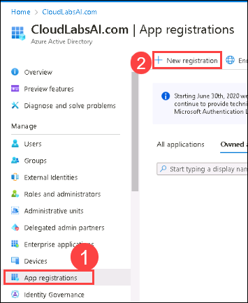

1.  On the **Register an application** blade, specify the following settings, and click **Register**:

    -   Name: **Stonith app<inject key="DeploymentID" enableCopy="false"/>**

    -   Supported account type: **Accounts in this organizational directory only**

1.  On the **Stonith app** blade, copy the value of **Application (client) ID** to Notepad. This will be referred to as **login_id** later in this exercise:

      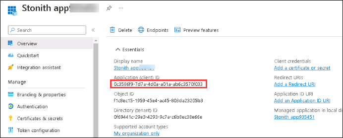

1.  On the **Stonith app** blade, click **Certificates & secrets**.

      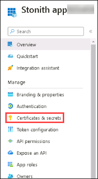

1.  On the **Stonith app - Certificates & secrets** blade, click **+ New client secret**.

1.  In the **Add a client secret** pane, in the **Description** text box, type **STONITH app key**, in the **Expires** section, leave the default **Recommended: 6 months**, and then click **Add**.

      

1.  Copy the resulting **Value** to Notepad (this entry is displayed only once, after you click **Add**). This will be referred to as **password** later in this exercise:

      
      
### Task 5: Grant permissions to Azure VMs to the service principal of the **STONITH app<inject key="DeploymentID" enableCopy="false"/>** 

1.  In the Azure portal, navigate to the blade of the **i20-db-0** Azure VM

1.  From the  **i20-db-0** blade, display the **i20-db-0 - Access control (IAM)** blade.

      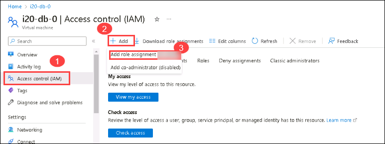

1.  From the **i20-db-0 - Access control (IAM)** blade, add a role assignment with the following settings:

    -   Assignment type: *Leave the default setting* and click on **Next**

    -   Role: Search and select **Virtual Machine Contributor** and click on **Next**

    -   Assign access to: **user, group, or service principal** and click on **+select members** and search and select **Stonith app<inject key="DeploymentID" enableCopy="false"/>** and click on **Add** and click on **Review + assign** twice to create the role assignment.

      
      
      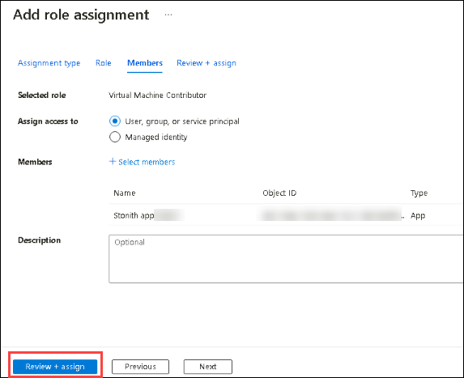      

1.  Repeat the previous steps to assign the Stonith app the Virtual Machine Contributor role to the **i20-db-1** Azure VM


### Task 6: Configure the STONITH cluster device 

1.  Within the RDP session to az12003a-vm0, switch to the PuTTY-based SSH session to i20-db-0.

1.  Within the RDP session to az12003a-vm0, in the PuTTY-based SSH session to i20-db-0, run the following commands (make sure to replace the `subscription_id`, `tenant_id`, `login_id,` and `password` placeholders with the values you identified in Exercise 3 Task 4:

    ```
    crm configure property stonith-enabled=true

    crm configure property concurrent-fencing=true

    crm configure primitive rsc_st_azure stonith:fence_azure_arm \
      params subscriptionId="subscription_id" resourceGroup="az12003a-sap-RG" tenantId="tenant_id" login="login_id" passwd="password" \
      pcmk_monitor_retries=4 pcmk_action_limit=3 power_timeout=240 pcmk_reboot_timeout=900 \
      op monitor interval=3600 timeout=120

    sudo crm configure property stonith-timeout=900
    ```

### Task 7: Review clustering configuration on Azure VMs running Linux by using Hawk

1.  Within the RDP session to az12003a-vm0, start Internet Explorer and navigate to **https://i20-db-0:7630**. This should display the SUSE Hawk sign-in page.

   > **Note**: Ignore **This site is not secure** message.
   
   

1.  On the SUSE Hawk sign in page, login by using the following credentials:

    -   Username: **hacluster**

    -   Password: **Pa55w.rd1234**

      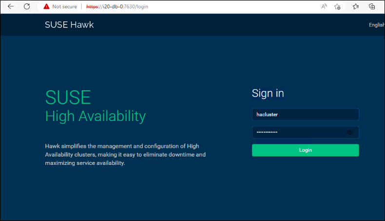

1.  Verify that the cluster status is healthy. If you are seeing a message indicating that one of two cluster nodes is unclean, restart that node from the Azure portal.

> **Result**: After you completed this exercise, you have configured clustering on Azure VMs running Linux to support a highly available SAP NetWeaver deployment

> **Congratulations** on completing the task! Now, it's time to validate it. Here are the steps:
> - Click the Lab Validation icon located at the upper right corner of the lab guide section which navigates to the Lab Validation Page.
> - Hit the Validate button for the corresponding task.If you receive a success message, you can proceed to the next task. 
> - If not, carefully read the error message and retry the step, following the instructions in the lab guide.
> - If you need any assistance, please contact us at labs-support@spektrasystems.com. We are available 24/7 to help you out.


## Exercise 4: Remove lab resources

Duration: 10 minutes

In this exercise, you will remove resources provisioned in this lab.

#### Task 1: Open Cloud Shell

1. At the top of the portal, click the **Cloud Shell** icon to open Cloud Shell pane and choose Bash as the shell.

1. In the Cloud Shell pane, run the following command to set the value of the variable `RESOURCE_GROUP_PREFIX` to the prefix of the name of the resource group containing the resources you provisioned in this lab:

    ```cli
    RESOURCE_GROUP_PREFIX='az12003a-'
    ```

1. In the Cloud Shell pane, run the following command to list all resource groups you created in this lab:

    ```cli
    az group list --query "[?starts_with(name,'$RESOURCE_GROUP_PREFIX')]".name --output tsv
    ```

1. Verify that the output contains only the resource group you created in this lab. This resource group with all of their resources will be deleted in the next task.

#### Task 2: Delete resource groups

1. In the Cloud Shell pane, run the following command to delete the resource group and their resources.

    ```cli
    az group list --query "[?starts_with(name,'$RESOURCE_GROUP_PREFIX')]".name --output tsv | xargs -L1 bash -c 'az group delete --name $0 --no-wait --yes'
    ```

1. Close the Cloud Shell pane.

> **Result**: After you completed this exercise, you have removed the resources used in this lab.

