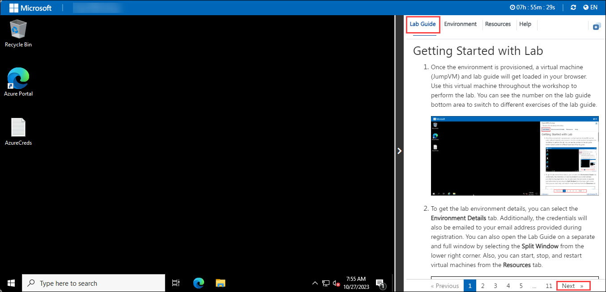
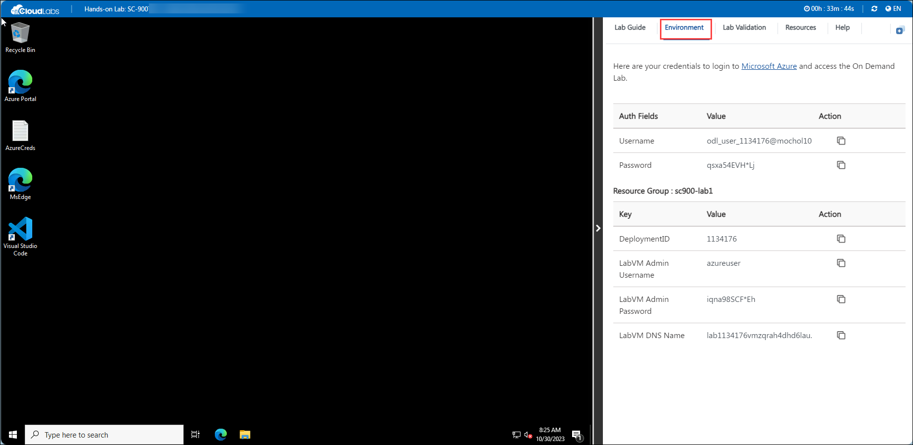
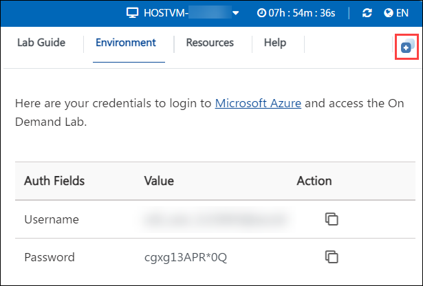
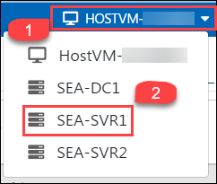
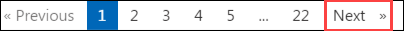
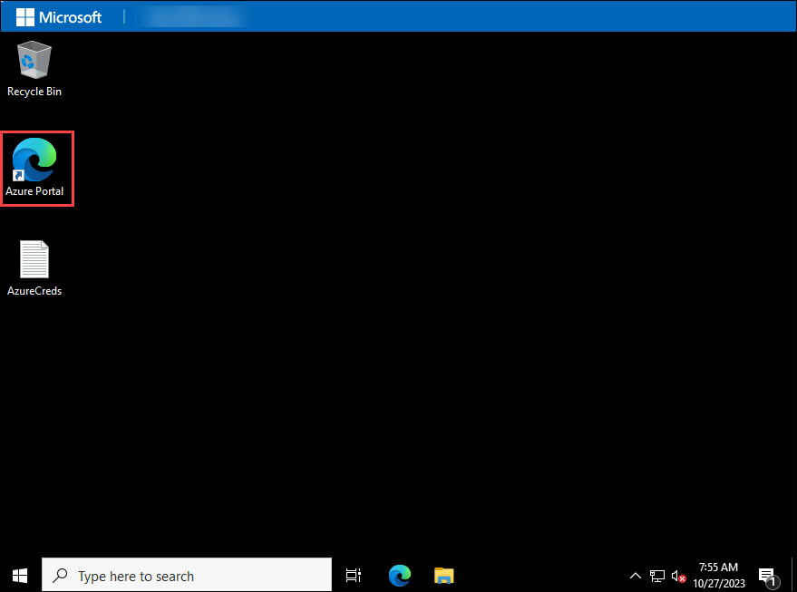

## Instructions

### Getting Started with Lab

1. Once the environment is provisioned, a virtual machine (JumpVM) on the left and lab guide on the right will get loaded in your browser. Use this virtual machine throughout the workshop to perform the lab.

    
    
1. To get the lab environment details, you can select the **Environment Details** tab. Additionally, the credentials will also be emailed to your email address provided at registration.

    

1. You can also open the Lab Guide on a separate full window by selecting the **Split Window** button from the bottom right corner.

    

1. To hide the lab guide, click on **>** symbol and to expose the lab guide, click on **<** symbol.   

1. Also, you can **start, stop and restart** the virtual machines from the **Resources** tab.

    

1. To Switch between the Virtual Machines, select the required VM from the dropdown.

    

1. Click on **Next** from the bottom right and follow the instructions to perform the lab.

       

## Task 1: Log in to Azure Portal and verify the pre-deployed resources

1. Let us start by logging into the Azure Portal to check the resources deployed for the lab environment. In the virtual machine (VM) on the left, click on the Azure portal desktop icon as shown below.

   
   
1. When you click on Azure portal, the edge browser welcome screen will come up, select **Start without your data**.

   
   
1. On the next window, click on **Continue without this data**.

   
   
1. Click on **Confirm and start browsing**.

   
   
1. Now, you will see two tabs in the edge browser, close the first tab named with **Microsoft Edge**.

1. On the **Sign in to Microsoft Azure** window, you will see the login screen, enter the following username and click on **Next**.

   * Email/Username: <inject key="AzureAdUserEmail"></inject>

   

1. Now enter the following password and click on **Sign in**. 

   * Password: <inject key="AzureAdUserPassword"></inject>
   
   

1. First-time users are often prompted to **Stay Signed In**, if you see any such pop-up, click on **No**

   

1. If you see the pop-up **You have free Azure Advisor recommendations!**, close the window to continue the lab.

1. If a **Welcome to Microsoft Azure** popup window appears, click **Maybe Later** to skip the tour.

1. Now you can see Azure Portal Dashboard, click on **Resource groups** from the Navigate panel to see the resource groups.

   

1. Now, click on **Next** from the lower right corner to move to the next page.
